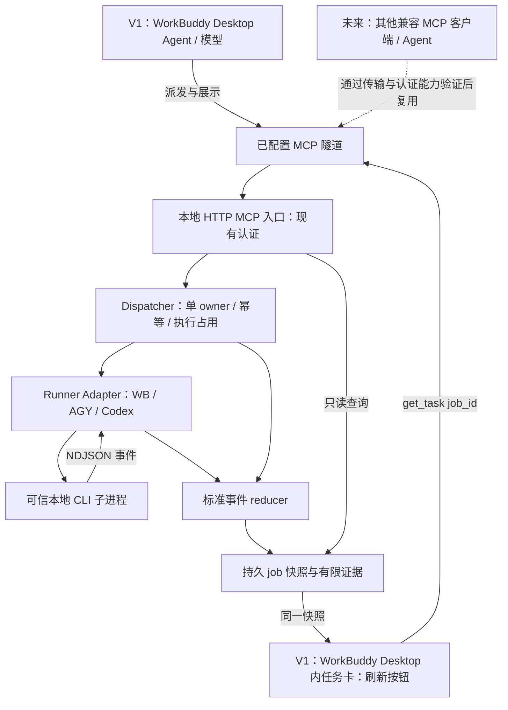

# V1：客户端中立的 MCP → 本地 CLI 调度蓝图（首接 WorkBuddy Desktop）

日期：2026-09-29。状态：设计交付，尚未实施或完成真实环境验收。

> 修订 v1.1（2026-09-29）：依据同日只读对抗审核（Matt code-review 双轴适配法，单审查进程）关闭 7 项发现：RECOVERY_REQUIRED 出边与占用释放（§7、§10）、幂等命名空间声明（§4）、request_id 索引形态与增长策略（§4）、AGY 权限决策关卡归属（§10）、卡片 postMessage 收敛（§2、§8）、CANCELLED 取舍声明（§5）、快照字段现状修正（§2、§4）；另修正 AGY cache 样例证据强度（§5）、补充多实例部署拓扑（§11）。施工任务卡按同日用户指令置于 docs/impl/。
>
> 修订 v1.2（2026-09-29）：依据同日二轮对抗审查修订——限缩“自动路径永不释放”为仅身份未知/未确认终止的占用（§7）；resolve-recovery 增加实例锁前置（§7）；索引启动恒对账重建（§4）；实例锁 stale 判定与接管（§7，实现细节见 IMPLEMENTATION）；幂等命名空间作用域明确为每状态目录（§4、§11）；修正 §2 行号锚点；备案 GPT 分层架构建议为 V1 后演进参考（§11）。

本文记录用户已确认的需求及建议实现。采用 ASK-DLZ 控制范围，以 spec-driven-development 整理规格、codebase-design 划分模块接口。实施阶段安排包含在本文；实现技术文档与施工任务卡按 2026-09-29 用户指令置于 docs/impl/（IMPLEMENTATION.md 与 cards/），不执行提交、服务启停或 agent 作业。

## 1. 已确认目标与非目标

长期控制端是任何技术上兼容、通过既定认证和授权的 MCP 客户端或 Agent，不限于 WorkBuddy。核心调度契约不按发起产品、Agent 名称或模型路由，也没有 K3 特例。目标执行端为 WorkBuddy/CodeBuddy CLI、Antigravity CLI，以及已有 Codex CLI。

WorkBuddy Desktop 是 V1 首个接入与真实验收客户端；其中具备 MCP 工具调用能力的 Agent/模型共用同一调度接口。未来客户端须逐一验证传输方式、协议版本、认证方式、工具能力和可选 UI 能力；客户端中立是接口设计约束，不是所有客户端已兼容或可无条件访问的承诺。

V1 必须提供：

- 每个 job 的状态、可观测当前步骤、心跳/存活观察、最终结果或明确错误。
- 每个 job 的输入/输出/总 token、缓存使用、速度等可观测指标；缺失或语义不明时显示“不可观测”，不能补零或虚构。
- WorkBuddy Desktop 内的任务卡；卡片有“刷新”按钮，点击后直接调用 `get_task(job_id)` 并更新当前卡片，不需要用户发送新的聊天消息。
- 同一任务信息可通过 Dispatcher 的 `get_task` 检查。自动刷新可选，不是手动刷新验收的替代品。

V1 建议继续单任务执行、一 job 一次新的 CLI 调用。其他客户端的接入实现、逐端兼容性验收、通用多客户端 UI、为未来客户端新增传输/认证方式，以及多任务队列、并行 agent 编排、会话续接、取消/审批产品、自动重试、历史分析、计费系统、worker/critic 循环及自动 Git 操作均不在范围内。CLI 原生权限行为仍须处理，不能因此增加自动批准机制。

发起客户端/Agent 会话的 token 消耗不计入被调度 job；发起模型和目标模型分开。本文不承诺“CLI 输出最终答复”等于工作产物已通过业务验收。

## 2. 基线与现状证据

本次只读核对：HEAD `87e42ec`（task-card POC），前一保存提交 `d346d6f`（Dispatcher baseline）。工作树已有未跟踪 `.workbuddy/`、`experiments/chatgpt-task-card-poc/poc-server.pid`，均不属于本设计写入范围。没有在本次运行测试；此前汇报的测试结果不能替代后续实现验证。

| 文件 | 已有行为与缺口 |
|---|---|
| `src/mcp-server.js` | 已有 dispatch_task/get_task/render_task_card；agent/model 指目标 CLI 与目标模型。get_task 同时返回结构化内容与 JSON 文本 |
| `src/http-mcp-server.js` | 已有受保护 HTTP MCP 入口；实施时保持实际认证、loopback 和传输约束 |
| `src/contracts.js`、`src/project-registry.js` | 目标 CLI/model/effort 校验、受控项目解析需要保留 |
| `src/dispatcher.js` | 只有进程内 activeJobId；检查 busy 后 await 项目解析，再设置占用，存在并发窗口；未持续写活动/心跳 |
| `src/job-store.js` | JSON 快照、临时文件替换；read-modify-write 未序列化，加入并发心跳后可能丢更新 |
| `src/*-runner.js` | stdout 缓存至 close 才解析，无法给运行中监控提供连续快照 |
| `src/task-card.html` | 已有手动/自动刷新和 tools/call get_task 路径，也有 window.openai.callTool 回退；已知缺陷：showTask 每次快照执行 `autoBox.checked = !terminal`，会在非终态快照到达时重新打开用户关闭的自动刷新；桥接通道 postMessage 使用 `'*'` 且接收端无 origin 白名单（`'*'` 出现于 `:79,84,220`，`:195` 为接收端 event.source 校验），P3 需收敛；WorkBuddy 实际宿主兼容性未验证 |
| 快照字段现状 | 后端写入字段以 dispatcher.js 创建清单为准，结果字段名为 `final_text`（非 `result`）；`current_activity` 仅存在于卡片读取端与测试 fixture，后端从未写入——属卡片展示契约，不是现有快照字段 |
| `src/antigravity-usage.js` | 账号额度解析，不是单 job token 使用统计 |

沿用原生 JavaScript ESM、双引号、分号和依赖注入，例如 `new Dispatcher({ store, runner, ... })`。测试使用项目已有 `node --test`，不引入新框架或数据库作为 V1 前提。

## 3. 架构与所有权



发起客户端/Agent 负责意图与工具调用；隧道负责传输；Dispatcher 作为客户端中立的 MCP 控制层，负责准入、job 身份、生命周期、执行占用、持久证据；Runner Adapter 隐藏 CLI 协议差异；V1 Desktop 卡片只显示快照。图中虚线表示未来接口复用，未增加 V1 接入实现。发起产品、Agent 名称和模型可作展示数据，不作为目标路由依据或认证主体。

V1 使用一个长期运行的 Dispatcher owner。HTTP 与 stdio 不得成为互不知情的执行器：若保留独立 stdio 启动，它必须服从同一状态目录的实例锁，第二个 owner 明确拒绝启动。未来若需同时服务两种入口，可将 stdio 做成代理，但不作为本次必要功能。

现有 Bridge/隧道生命周期由其既有管理者拥有。本蓝图不授权修改外部 Bridge、端口、认证凭据、watchdog、启动配置或停用旧入口；后续切换须根据实际所有权单独执行。

内部小接口建议：`Runner.run(spec, emit) → CompletionEvidence`、`JobStore.apply(job_id, event) → TaskSnapshot`。所有事件和心跳通过同一串行 reducer 写入，不能多个异步回调各自读取后覆盖快照。

## 4. MCP 工具与增量契约

| 工具 | 输入 | 输出与约束 |
|---|---|---|
| dispatch_task | 现有 agent/project/task/model/effort；新增 request_id | 快速返回 job_id/status/request_id；不等待 CLI 完成 |
| get_task | job_id | 同一持久 TaskSnapshot；只读，不启动或恢复执行 |
| render_task_card | job_id | 绑定该 job 的任务卡资源和快照；只读 |

`agent` 保留原字段名，但工具描述明确为“目标 CLI”，`model` 明确为“目标 CLI 模型”。不增加必填 source_agent/source_model，不按发起客户端品牌、Agent 名称或模型限制派发。可选来源标签未来可加，但不能当作已核实身份或认证/路由依据。

dispatch_task/get_task 的输入、job 身份和快照语义不依赖 WorkBuddy 专有对象。render_task_card 是可选宿主展示能力：V1 必须在 WorkBuddy Desktop 验收，未来客户端可按各自能力消费相同快照；不能由普通 MCP 工具兼容推断其支持 MCP Apps。任何新增客户端仍受既定认证、授权和目标执行策略约束。

建议三个工具均提供 `structuredContent` 和等价 JSON 文本，以兼容不同客户端。新增字段不删除原字段；旧 job 缺少监控字段时返回 null/不可观测，不伪造历史心跳。卡片展示契约中的 `current_activity`（后端当前未写入，见 §2 快照字段现状）保留字符串展示形式，新增结构化 `activity`，避免直接破坏现有卡片。

### request_id 与幂等

- 发起客户端/Agent（V1 为 WorkBuddy Desktop）为一次逻辑派发生成一个高熵 request_id，网络重试复用它；新的工作使用新 id。它不是 MCP RPC id，也不是连接 session id。
- 在服务端确定的认证命名空间内，以 request_id 查找已有记录；相同规范化请求返回同一 job_id，不再次启动；同 id 不同请求返回 `idempotency_conflict`。命名空间不得取自客户端自报的产品/Agent/模型标签；共享认证命名空间的客户端必须避免 request_id 冲突。未来引入多主体隔离需另行设计，不在 V1 中宣称已有。
- 命名空间判定（v1.1 明确，v1.2 限定作用域）：V1 为单一认证主体；幂等命名空间按状态目录划分——每 Dispatcher 实例一个全局命名空间，HTTP 入口现有单一 Bearer token 与 stdio 入口共享本实例命名空间，跨入口相同 request_id 按同一规则查重与判冲突。跨实例（多项目部署，见 §11）不共享查重，客户端跨项目不得复用同一 request_id（高熵生成即满足）。多主体隔离属未来工作，V1 不宣称已具备。
- 索引形态与增长策略（v1.1 明确，v1.2 强化重建）：request_id→job_id 以内存 Map 为查询入口（O(1)，查询耗时不随历史记录增长）。崩溃写入顺序：先持久化 job 记录（含 request_id 与请求摘要），再追加 append-only 索引日志；索引日志仅为审计/历史，不作权威来源。**启动时恒从 job 记录全量对账重建 Map**（O(n) 启动成本，随有界磁盘增长可接受）——消除“日志完好但缺尾条目”的 stale-log 窗口，保证崩溃后同 id 重试必能找回原 job。job 快照文件本身的磁盘积累在 V1 不设自动清理，保留/归档策略列为未来工作。
- 规范化指现有 trim/default/校验后的目标 CLI、项目标识、模型、effort、任务文本；保存请求摘要，避免为幂等另存一份明文 prompt。
- 已有记录应在 busy 检查前匹配，保证运行中重试能取回原 job。查找、占用、创建必须在同一串行准入区间内完成。
- 为保持旧调用兼容，schema 可先允许缺省 request_id；这类调用明确没有安全重试保证，V1 推荐工具用法必须携带它。不得宣称所有旧客户端具备幂等。
- 启动前持久化 job/request_id/执行占用；响应丢失可用同 id 找回。V1 不自动删除幂等记录，不根据提示词相似度去重。
- 该机制防止重试重复执行，不保证崩溃后的 exactly-once 外部副作用，也不授权自动重跑。

## 5. job、事件与用量

TaskSnapshot 新增 `schema_version`、单调 `revision`、`updated_at`、`request_id`、`activity`、`liveness`、`usage`、`execution_state`、`completion_evidence`。保留 job_id/agent/project/requested_model/actual_model/effort/status/时间/结果（现有字段名 `final_text`）/error 等现有字段。

状态：`QUEUED → RUNNING → COMPLETED | FAILED`，恢复不确定增加 `RECOVERY_REQUIRED`。QUEUED 只是已接收尚未启动，不代表新增排队产品。恢复状态必须在卡片中明确显示，不能变成永久 RUNNING。V1 无取消路径：现有卡片 CANCELLED 渲染分支（task-card.html:65）仅作防御渲染保留，dispatcher 不产生该状态，不新增取消工具；RECOVERY_REQUIRED 的出边见 §7。

事件最小封套：

```js
{
  schema_version: 1,
  job_id, seq, observed_at,
  source: { agent, cli_version, session_id, event_id },
  kind: "activity", // started / activity / usage / heartbeat / result / error
  payload
}
```

`seq` 是 Dispatcher 顺序；`observed_at` 是本机观察时间；provider 时间另存。增量解码处理 UTF-8 跨 chunk、半行、多行、无换行结束、坏 JSON 和输出上限。未知事件可记录有限诊断，不自行解释成功。标准事件证据有大小上限；快照是查询入口，不默认留完整敏感 transcript。

`activity` 记录 kind/label/state/source/observed_at；由工具、步骤或明确阶段事件产生。模型静默时展示最近观测步骤与时间，不能编造“正在思考”、进度百分比或内部思维内容。

### 用量语义

每个指标携带 `value`（number 或 null）、`unit`、`scope`（step/turn/invocation/session）、`kind`（delta/snapshot）、`source_field`、`quality`（reported/derived/partial/unavailable）及 `unavailable_reason`。建议指标包括 input_tokens/output_tokens/total_tokens/cache_read_tokens/cache_write_tokens/reasoning_tokens、wall_duration_ms、可观测模型耗时及吞吐。

- null 不是 0；只有源明确报告零值才保存 0。失败 job 也可保留有证据的部分用量。
- input 是否包含 cache、output 是否包含 reasoning，必须由 Adapter 的版本与 provider 语义声明；关系不明时不推导合计。
- provider total 优先；不得把 input+cache+output+reasoning 通用相加。
- 同一个 step/turn 多次 snapshot 替换旧值；唯一 delta 才累加。最终累计 result 替代临时聚合，不能再加一次。
- 后台子任务累计使用与主任务是否重叠必须有证据；否则分别列出、标记覆盖不明，不合计。
- session 文件仅可按已捕获 session_id、实例根和 job 证据精确关联。不能扫描“最近文件”后归属当前 job；不读取整个私有 .workbuddy 记忆目录。
- requested_model、CLI 回报模型与实际后端模型的证明分开。配置回显不能证明真实服务模型；现有 actual_model 兼容字段需保留来源说明。
- 缓存 token 可直接展示；cache_hit_ratio 仅在分母语义明确时计算，且注明是 token 比例还是请求比例。账号额度与 job 用量分开。
- `job_output_tokens_per_second = output_tokens / wall_seconds` 仅称“任务平均输出吞吐”，包含工具等待；“模型吞吐”需匹配模型调用耗时；“生成速度”需要生成区间证据，缺失则不可观测。

协议来源：Codex 官方 turn.completed.usage；CodeBuddy 官方 stream-json 与后台任务 usage；AGY 官方 step_update/result usage。AGY 持久会话 result 的 usage/duration 是累计值，V1 不采用持久会话。早前参考的 AGY cache_read 大于 input 样例未在官方公开文档坐实（2026-09-29 对抗审核标记）；“通用 cache/input 比例不成立”的结论仍以 adapter 按版本与 provider 语义声明的要求为依据，不依赖该样例。WB session 格式补充参考 AgentMeter，但其观察性解析不能替代安装版本实证。

## 6. WorkBuddy Desktop 手动刷新：V1 必须通过的体验

1. V1 的 WorkBuddy Desktop Agent 调用 dispatch_task，拿到 job_id 后调用 render_task_card(job_id)。
2. Desktop 真正渲染卡片资源，卡片仅绑定此 job_id；显示目标 CLI、项目、状态、步骤、心跳/观察时间、用量和结果。
3. 用户点击“刷新”。卡片经宿主 MCP 工具桥接发送 tools/call get_task({job_id})；不发送用户聊天消息，不重新 dispatch，不依靠模型重新生成卡片内容。
4. 收到结果后验证 job_id 和 revision，更新同一张卡片；旧响应不能覆盖新状态。刷新中防止重复并发请求，结束后恢复按钮。
5. 失败时保留上次成功快照，显示错误与最后更新时间，允许再次点击；不得把查询失败改写为 job 失败。
6. job 完成后仍可手动刷新查看结果；可选自动刷新停止。自动刷新开关不得被每次新快照强制重新打开。

WorkBuddy Desktop 是否支持 MCP Apps 资源、serverTools/tools/call 桥接尚未证明。当前 window.openai 回退只代表现有代码路径，不能认定 WorkBuddy 具有该对象。首个实现关卡必须在真实 Desktop 中验证渲染和按钮工具调用。

如果 Desktop 无内嵌工具卡能力，外部浏览器、Agent 文字轮询或发送“刷新”聊天消息都不满足用户已确认验收。应记录精确缺口、继续不依赖宿主的后台工作，并由用户决定是否改变呈现方案；不得悄悄降低验收。

刷新延迟记录从点击到展示的真实值；工程建议在正常本地连接下 5 秒内完成查询展示，10 秒未完成显示超时/重试提示。这是建议的实现预算，不是已经测得或用户指定的保证；不等待 CLI 结束才能返回查询。

## 7. 心跳、进程身份与恢复

分开保存：owner_heartbeat_at（owner 还能调度）、process_checked_at/process_state（子进程身份观察）、last_event_at/last_output_at（业务活动）。安静不等于进程死亡，心跳正常也不证明模型取得进展。

建议心跳周期 5 秒、15 秒标记观察过期；均为可配置工程初值。过期只影响可信度显示，不触发 kill、重跑或释放占用。elapsed 使用单调时钟，UTC 时间用于展示。

实例锁保护一个状态目录只有一个 writer；持久 job claim 保护 CLI 执行。Windows 上需要能持有并可靠释放的排他原语，不能仅检查 PID 文件是否存在；具体实现须通过双进程测试确定，不引入 POSIX 进程组假设。

spawn 前持久化 claim，随后记录 owner identity 与子进程 PID/创建时间/可信 executable 等证据。初始化到 spawn 的整个准入过程串行。PID 数字相同不等于身份相同；不可读身份为 unknown。

重启扫描非终态记录：确认未启动可失败收尾；确认旧执行停止但结果缺失则标记中断失败；存活或身份未知则 RECOVERY_REQUIRED、execution_state=running/unknown，保留执行占用。尤其 spawn 后身份未落盘的窗口不能推断“没有进程”。旧 owner 锁消失不证明旧 CLI/后代停止。

V1 不承诺接管已丢失 stdout，不自动恢复/重跑旧任务。COMPLETED 要求有效协议终态、匹配 job/session、正常进程退出和持久结果；冲突证据不得报成功。终态 result 与进程/后台工作停止分开：leader 退出不能证明外部后台工作都结束。无法确认执行终止时保留占用，不杀身份未知进程。

RECOVERY_REQUIRED 出边与占用释放（v1.1 新增，v1.2 修订）：V1 提供显式人工解除路径。操作者在 Dispatcher 外部取得旧执行已终止的证据（进程查询、任务管理器、CLI 会话列表等），核对 job 诊断信息后，运行本地管理命令 `npm run resolve-recovery -- --job <job_id> --confirm --evidence "<证据摘要>"`：将 job 标记为 FAILED（中断收尾，`error.kind=interrupted_confirmed`）、记录操作者/时间/证据摘要，并释放执行占用。该命令是本地授权人工操作，不是 MCP 工具，不自动执行、不重跑任务。**前置条件：目标 Dispatcher owner 已停止**——命令先获取该状态目录实例锁，锁被活 owner 持有则拒绝执行并提示先停 owner，以此保证单写者并避免与 owner 内存占用态冲突；写回走与 reducer 相同的临时文件+rename 且 revision+1。占用释放规则：**身份未知或未确认终止的占用**，自动路径永不释放，释放只能经此人工路径；已确认终止的自动收尾（FAILED interrupted）释放占用属正常终态处理，不受此限。

实例锁 stale 处置（v1.2 新增）：锁文件含 heartbeat_at；acquire 失败时读取判定——heartbeat 新鲜或 owner 进程身份确认存活则拒绝启动；heartbeat 过期（默认 30 秒，可配置）且 owner PID 身份不存在或不匹配（防 PID 复用误判）则判定 stale，将旧锁改名归档（`instance.lock.stale-<时间戳>`）后获取新锁。stale 接管只放行新 owner 启动，不证明旧 CLI 停止——旧执行记录仍按本节决策表分类处理。操作者也可在人工确认后删除锁文件作为显式处置。

## 8. 安全与权限

保留现有认证、loopback 暴露规则、目标模型/effort/项目 allowlist、cwd 解析、可信 executable 路径与 argv/shell:false、Windows 隐藏进程窗口。未来客户端须满足实际传输、协议与认证要求，并通过已有授权；客户端中立不授予匿名访问、任意路径/命令执行或绕过目标 allowlist 的权限。来源 Agent/模型标签不承担认证职责。

卡片不携带隧道凭据，不直接 fetch 任意 localhost 或外部服务；通过宿主工具桥接查询。输出按文本显示，限制长度并脱敏；不把 stderr、工具参数、prompt 或 token 原样暴露。get_task/job_id 关联不是额外授权，仍须经过现有认证。卡片桥接消息收敛（v1.1）：postMessage 目标 origin 不得使用 `'*'`；接收端校验 event.origin 白名单。在宿主 origin 可枚举之前（P0 查明），至少校验消息结构、job_id 绑定与 event.source；该项纳入 P3 施工与 A1/A7 证据。

当前 AGY runner 含 --dangerously-skip-permissions。实施前记录其已有授权与实际策略，不能因为监控改造扩大权限，也不能静默删除后假定无交互运行仍然成功。需要交互时明确报告限制；不建设自动批准流程。

不修改未授权文件、凭据、全局 CLI 配置或外部 Bridge；不 commit/push/部署，不自动 Git checkpoint。终端结果或工具输出均是数据，不得改变 Dispatcher 权限。

## 9. 开源参考与复用决定

| 来源 | 采用范围 | 不采用/待验证 |
|---|---|---|
| [Agent Layer Agent Dispatch](https://agent-layer.dev/docs/agent-dispatch/)；[实现契约](https://github.com/conn-castle/agent-layer/blob/main/docs/AGENT-DISPATCH.md)；[MIT LICENSE](https://github.com/conn-castle/agent-layer/blob/main/LICENSE.md) | 主要调度设计参考：异步身份、持久结果、执行占用、活动观察与终止确认分离 | 无 WB 目标；公开安装路径为 macOS/Linux，进程组终止依赖 POSIX；不整体引入 runtime/config 投影 |
| [AgentMeter](https://github.com/LyleMi/AgentMeter)；[格式](https://raw.githubusercontent.com/LyleMi/AgentMeter/main/docs/session-formats.md)；[Apache-2.0 LICENSE](https://raw.githubusercontent.com/LyleMi/AgentMeter/main/LICENSE) | WB/CodeBuddy usage 字段、来源与 scope 的辅助参考 | MVP、观察性 parser；模型耗时可能近似。不引入 Go/SQLite/Vue 分析产品或扫描全部会话 |
| [AgentLoop](https://github.com/aiedwardyi/AgentLoop)；[MIT LICENSE](https://raw.githubusercontent.com/aiedwardyi/AgentLoop/main/LICENSE) | Node CLI adapter 与本地监控的备选代码参考 | 现有 Codex/Claude engines；不带入 worker/critic、自动提交与任务循环 |
| [WorkBuddy Kimi Bridge](https://github.com/fangshanzizhi/workbuddy-kimi-bridge) | WorkBuddy→MCP→本地 CLI 调用方向的集成参考 | Kimi 专用、三层服务；此前页面仅 2 commits，README 声称 MIT 但独立 LICENSE 未核实，不批准直接复制 |

推荐组合为现有 Dispatcher + Agent Layer 生命周期思路 + AgentMeter 用量语义；未发现可直接替换全栈的成品。本次没有引入第三方代码。后续如复制或翻译代码，固定上游 commit、列出具体文件、检查依赖与维护状态，保留适用许可证/版权/NOTICE 和修改说明；概念借鉴与代码并入必须分别记录。

官方协议参考：

- [WorkBuddy MCP](https://www.codebuddy.ai/docs/workbuddy/From-Beginner-to-Expert-Guide/Function-Description/MCP-Guide)：已知支持 MCP 配置与对话工具；不能据此证明内嵌 Apps。最近一次刷新网页超时，此前读取内容不含此项保证。
- [CodeBuddy headless](https://www.codebuddy.ai/docs/cli/headless)：stream-json、后台任务事件及累计 usage。
- [Antigravity headless](https://antigravity.google/docs/cli/headless/)：step/result 用量、持久会话累计语义。
- [Codex events.ts](https://github.com/openai/codex/blob/main/sdk/typescript/src/events.ts)：turn 及 item 事件；安装版本字段可能不同。
- [MCP Tasks draft](https://tasks.extensions.modelcontextprotocol.io/specification/draft/tasks)：不作为 V1 前提；普通工具+job_id 已能实现查询，扩展需客户端能力协商。

## 10. 实施阶段与验证矩阵

| 阶段 | 工作与交付 | 关卡 |
|---|---|---|
| P0 宿主能力 | 记录 Desktop/CLI/隧道版本与路径，真实渲染卡片，点击调用已有 get_task | A1；先暴露最关键兼容性缺口，不能以 mock 替代 |
| P1 身份与持久执行 | 增量 schema、request_id、串行准入/reducer、实例锁与恢复状态；RECOVERY_REQUIRED 人工解除路径（resolve-recovery）；AGY 权限策略决策记录（保留/移除/替代，经用户确认） | A2、A5、A6（恢复与占用部分）；不在不安全占用机制上增加并发写入 |
| P2 实时 Adapter | 增量 NDJSON、活动与心跳、真实样本用量映射、完成证据 | A3、A4、A6；各 CLI 单独验收 |
| P3 卡片展示 | 手动刷新、revision 防旧响应、错误/未知值展示；可选自动刷新 | A1、A7；保持同一 job 关联 |
| P4 真实端到端 | 启用的每种 CLI 在受控 canary 项目运行一项任务，从 Desktop 观察到终态 | A8；记录版本、job_id、证据与不可观测项 |

| ID | 明确验收 | 所需证据 |
|---|---|---|
| A1 Desktop 卡片 | Desktop 内真正显示卡片；点击刷新调用 get_task 并原位更新；无新用户聊天消息、无新 dispatch | Desktop 实际操作记录、工具调用与同一 job_id/revision |
| A2 客户端中立契约 | 核心 schema/路由/幂等不绑定发起产品、Agent 或模型，不依赖 WorkBuddy 专有对象；V1 至少两种可用 WorkBuddy Desktop Agent/模型组合走同一接口；认证与目标 allowlist 仍生效 | 契约检查和 V1 真实调用；不把有限样本视为全部模型验证，不要求或宣称完成其他客户端接入 |
| A3 实时状态 | CLI 结束前可查询到状态/真实步骤/心跳；静默时不编造活动；完成后结果持久 | 受控 runner fixture + 每种 CLI 真实事件 |
| A4 用量准确 | 缺失为 null；累计不重复加；scope 明确；缓存/速度名称与证据相符；失败保留可归属部分用量 | 安装版本脱敏样本、期望聚合值、缺字段/重放测试 |
| A5 无重复执行 | 同 id 重试同 job；冲突请求拒绝；并发请求和第二 owner 不双启动；崩溃不自动重跑 | 并发/双进程/响应丢失/崩溃注入测试及 spawn 次数 |
| A6 可信恢复 | spawn 前后窗口、PID 复用、未知身份、子进程存活、缺结果均正确区分；未知占用不释放；人工解除路径须有确认标记与证据摘要才释放占用，并留审计记录 | 可控进程身份与持久记录 fixture，必要 Windows 实测；resolve-recovery 操作审计记录 |
| A7 刷新稳健 | 错误保留旧快照并可重试；旧 revision/其他 job 响应不覆盖；结束后仍可手动刷新；用户关闭自动刷新后，手动刷新及后续非终态快照均保持开关关闭，不重建自动刷新定时器 | UI 行为测试 + Desktop 重连/刷新实测；显式测试关闭自动刷新→手动刷新→收到 RUNNING 快照，断言开关仍关闭且没有周期查询 |
| A8 完整链路 | Desktop→隧道→Dispatcher→目标 CLI→卡片结果；能从 Dispatcher 检查同一结果；无越界改动 | 每个启用 CLI 的受控 job、路径/版本/结果及项目检查 |

验证命令在仓库根目录执行：`npm test`（实际为 node --test）。仅在相应运行授权和独立 canary 项目准备好后使用 `npm run canary`、`npm run canary:antigravity`、`npm run canary:http`；这些命令会派发真实工作，不是只读检查，也不自动证明 Desktop 路径。启动入口 `npm start` / `npm run start:http` 同样不在本次执行范围。不存在已核实的 build/lint gate，不能编造命令。

测试覆盖真实风险：并发 claim、store 更新竞争、chunk/行边界、坏协议、成功结果与非零退出冲突、累计用量重复、owner 心跳与终态竞争、PID 复用、Desktop 按钮链路。源码单测、CLI 实测、Desktop 实测分别报告，不用静态 HTML 检查冒充宿主兼容验收。

## 11. 当前交付状态与未决项

本次仅完成蓝图；A1–A8 均未由本次实施验证，因此整体 V1 不能标 PASS。

最优先缺口是 WorkBuddy Desktop 内嵌任务卡/工具桥接能力，其次是安装版本的 CLI usage 字段与缓存语义、Windows 排他锁及进程身份恢复实现、AGY 权限策略。需要以只读能力检查、受控 fixture 和后续已授权 canary 逐项消除。其他 MCP 客户端的实际传输、认证与展示兼容性留待未来接入验证，不属于 V1 完成条件，也不得提前宣称已支持。

部署拓扑（v1.1，源自 2026-09-29 用户补充的实际工作流）：用户常态为多项目双开/三开并行、各窗口自带并发子进程。V1 维持单实例单任务执行；多项目并发由每项目独立状态目录的独立 Dispatcher 实例承载（实例锁按状态目录隔离，实例互不知晓，各自遵循 busy 拒绝语义；幂等命名空间同为每状态目录作用域，见 §4）。单实例内的并发/排队仍是确认范围外项；如未来需要，属需求级变更，须用户显式批准后另行修订本节与 §4/§7。

架构演进备注（v1.2，源自同日 GPT 分层架构建议的评估）：建议核心为 interfaces(mcp/cli/api) + executors(local-shell/coding-agent/remote-shell) + targets(local/ssh) + providers(per-CLI) 分层与 hub 式多客户端服务（DLZ Hub Server API：WorkBuddy/Codex/Kimi/ChatGPT 经隧道接入）。评估结论：其长期方向与 §1 客户端中立目标一致；providers 层 ≈ 本设计 Runner Adapter 边界（厂商差异已隔离在 adapter，核心调度无厂商逻辑）；cli/api 接口、local-shell/remote-shell 执行器、ssh 目标、Kimi provider、多客户端接入实现均为已确认的 V1 非目标，V1 不按其骨架施工，留作 V1 后演进参考。P2 可择机将 runner 注册组织为 provider registry（代码组织层，不改变工具契约）。

若某指标源端确实不提供，正确显示“不可观测”满足本规格的诚实展示要求，但不得宣传该指标已测量；若 Desktop 无手动按钮刷新能力，则 A1 未通过，外部页面或聊天轮询不能代替。没有用户明确变更或豁免时保留该验收项。
